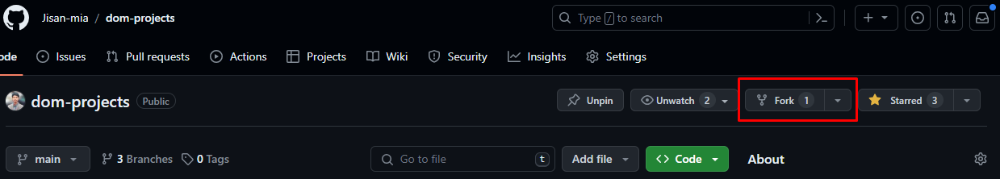
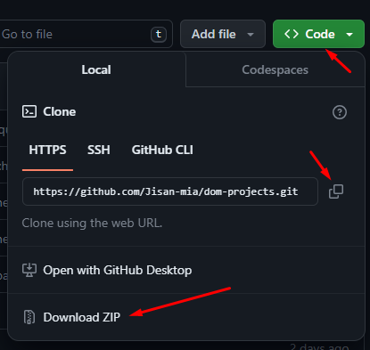
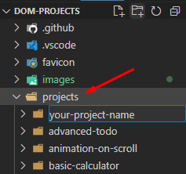
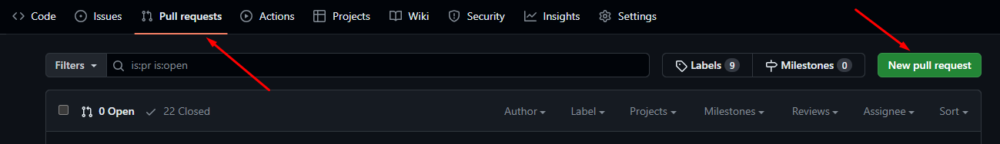

# CONTRIBUTING

Contributions are always welcome, no matter how large or small. Before contributing,
please read the [code of conduct](CODE_OF_CONDUCT.md).

Some thoughts to help you contribute to this project

## Contribution guideline

If you want to contribute by creating a new **Project** using **HTML, CSS and JavaScript**, please follow the below steps.

Which project you should contribute?

- Well you should be contributing any projects as long as they are built using only `HTML, CSS, JavaScript`.
- What if the project i want to contribute already exists in the projects list? No worries! you can still contribute your project, just name your project uniquely and try writing your code and style differently from other existing projects.

### Step by step guide

1. First, you need to fork the this **repository**. You can do this by clicking the Fork button on the top right corner of the repo.

   

2. Once forked, you can clone the repo by clicking the `Code` dropdown button on the top right corner of the forked repo.

   - Then you can either choose to clone it by copying the `HTTPS URL` and running this command `git clone <Copied HTTPS URL>` on the terminal, after cloning navigate to the project folder by `cd dom-projects`, from there open the `index.html` file in the browser
   - or just click on `Download ZIP` item from the bottom, this will download the whole project, you can extract the zip folder and open the root `index.html` file in the browser

   

3. Now, time to add your project on the projects folder. First copy your project, then paste it into the projects folder.

   

4. Last step: open the `data.json` file, scroll the the bottom, there you should create a json object following the last item which will contain information of your project like where it's located what's your project name etc. Below is an example of `json object` for a `todo project`
   ```json
   {
     "id": 20,
     "name": "Simple Todo App",
     "description": "It's a kinda TODO site where anyone can add todo, complete, and delete them. I've worked with the date object too in this project.",
     "image": "https://user-images.githubusercontent.com/61211600/227636791-d716e1ba-03b3-4791-9b87-4dee1417b68c.png",
     "url": "./projects/js-todo/",
     "github": "https://github.com/Jisan-mia/dom-projects/tree/main/projects/js-todo/",
     "difficulty": "Intermediate", // Beginner, Intermediate, Advanced
     "tags": ["html", "css", "js"]
   }
   ```

- Explanation of the attributes:

  - `id`: project serial number
  - `name`: your project name
  - `description`: a sort description of your project
  - `image`: an image url you can put your project image url by adding it to the images folder or uploading in a server
  - `url`: project location where is your project is located in the `projects` folder for example: `./projects/your-project-name/`
  - `github`: github url for this project, the url should be like this `https://github.com/Jisan-mia/dom-projects/tree/main/projects/<your-project-name>/`, you should only change `<your-project-name>` section
  - `difficulty`: write your project difficulty, value should be one of these three **Beginner, Intermediate, Advanced**
  - `tags`: an array of string where you should write what frontend concepts you utilized building your project like `['Semantic HTML', 'CSS Flexbox', 'DOM Manipulation']`

5. To wrap it, first you should copy-paste your project into the `projects` folder then write detail about your project in the `data.json` file in a json object.

6. Now, before pushing the code to the repository, create a new branch, name it as your project-name and then push it.
   - `git checkout -b <your-project-name>`
   - `git add .`
   - `git commit -m 'our commit message'`
   - `git push`
7. After pushing your code, create a `pull request` by clicking on the **New pull request** button from the **Pull requests** tab
   

8. Now, we'll review your pull request and if everything is okay, we'll merge it to the main branch and your project will be live on this site [https://www.jisan.io/dom-projects/](https://www.jisan.io/dom-projects/)

## Recommended Communication Style

1. Always leave screenshots for visuals changes
1. Always leave a detailed description in the Pull Request. Leave nothing ambiguous for the reviewer.
1. Always review your code first. Do this by leaving comments in your coding noting questions, or interesting things for the reviewer.
1. Always communicate. Whether it is in the issue or the pull request, keeping the lines of communication helps everyone around you.
